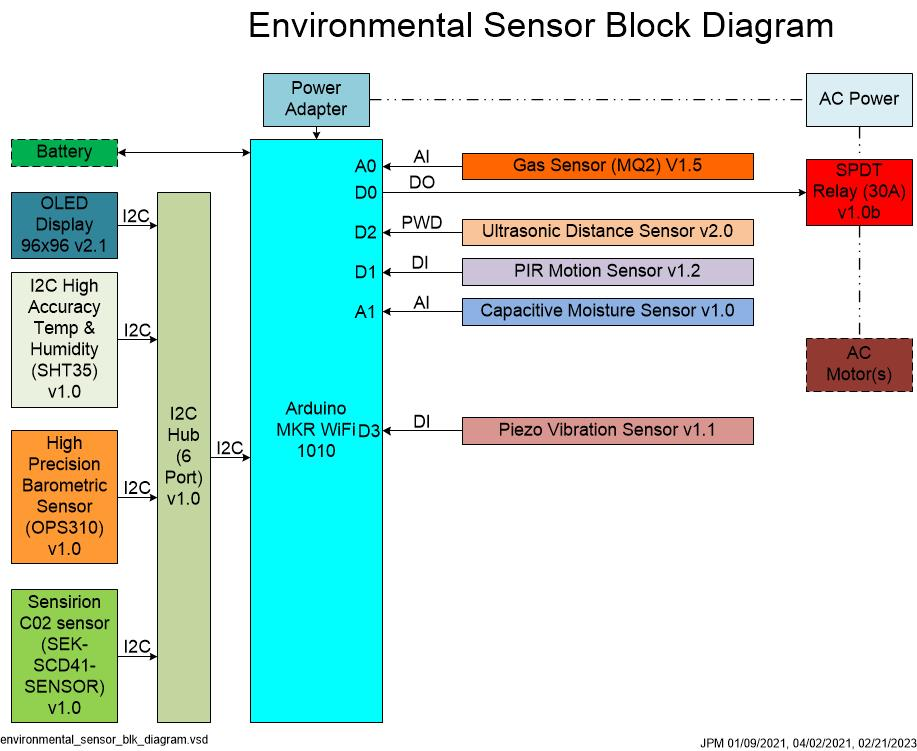

# Environmental Sensor Monitor
The sensor system described below began as means to monitor and control a sump pump. It as evolved to integrate more senses and components to enable development of Direct Air Carbon Capture (DACC) systems.


## Sensor Architecture
This sensor system is built around the Arduino MKR WiFi 1010 single board microcontroller board. The MKR 1010 has a SAMD21 Cortex®-M0+ 32bit low power ARM® MCU and is paired with the Grove compatible Arduino MKR Connector Carrier board to provide easy connections to sensors. The block diagram below shows the current sensor system architecture, and connections to the MKR 1010.



A six port I2C hub is used to connect the MKR 1010 to the High Accuracy Temp & Humidity Sensor, the High Precision Barometric Sensor (DSPS310), the CO2 sensor, and an OLED display. The PIR Motion Sensor, and Piezo Vibration Sensor are connected to digital inputs of the MKR 1010. The Relay is connected to a digital output and the Ultrasonic Distance Sensor is connected to a PWM input. The Gas sensor and Capacitive Moisture Sensor are connected to analog input pins. The figure blow shows the sensors and connections to the MKR 1010.


The first iteration of the sensor system was described in [Arduino MKR WiFi 1010 on the Cloud Demo](https://www.p-brane.com/nano/blogpost1297-Arduino-MKR-WiFi-1010-on-the-Cloud-Demo), and [Arduino WiFi 1010 with carrier board and Sensor Demo](https://www.p-brane.com/nano/blogpost1294-Arduino-WiFi-1010-with-carrier-board-and-Sensor-Demo). The system was upgraded with a wider variety of sensors. The software was updated too to support the new suite of sensors.

To make it easier to move the sensors around, the system was packaged into a carboard box. Pink ESD foam was used to minimize static build up and provide some cushioning for the components.

### Sensor Suite

The system uses the following sensors.

* [Gas Sensor (MQ2) V1.5](https://wiki.seeedstudio.com/Grove-Gas_Sensor-MQ2/)
  * The MQ2 gas sensor that can detect $H_2$, LPG, $CH_4$, CO, Alcohol, Smoke or Propane,
  * Dissipates a lot of power.
  * Can't distinguish between a number of the different gasses.
* [Ultrasonic Distance Sensor v2.0](https://wiki.seeedstudio.com/Grove-Ultrasonic_Ranger/)
  * measures distance from the sensor from 2 to 350 centimeters.
* [PIR Motion Sensor v1.2](https://wiki.seeedstudio.com/Grove-PIR_Motion_Sensor/)
  * Detects movement up to 3 m away
* [Capacitive Moisture Sensor v1.0](https://wiki.seeedstudio.com/Grove-Capacitive_Moisture_Sensor-Corrosion-Resistant/)
  * Detects changes in moisture based on changes in capacitance.
* [Piezo Vibration Sensor v1.1](https://wiki.seeedstudio.com/Grove-Piezo_Vibration_Sensor/)
  * Detects vibrations ranging from 0.1 Hz to 180 Hz using a piezo sensor.
* [SPDT Relay (30A) v1.0b](https://wiki.seeedstudio.com/Grove-SPDT_Relay_30A/)
  * SPDT relay for switching 30 A using a digital output from the MKR 1010.
* [High Accuracy Temp & Humidity Sensor (SHT35) v1.0](https://wiki.seeedstudio.com/Grove-TempAndHumi_Sensor-SHT31/)
   * CMOS temperature and humidity sensor with digital output over the I2C bus.
   * Board connector: [114020164](https://www.mouser.com/ProductDetail/Seeed-Studio/114020164?qs=7MVldsJ5Uayw%2FOfizq4F8w%3D%3D),  [Datasheet](https://www.mouser.com/datasheet/2/744/Grove_Female_Header_-_SMD-4P-2.0mm_Datasheet-1853538.pdf) also known as HW4-SMD-2.0-90D
  * Approximate board envelop: 45 mm x 23 mm x 7 mm (LxWxD)
* [High Precision Barometric Sensor (DSPS310) v1.0](https://wiki.seeedstudio.com/Grove-High-Precision-Barometric-Pressure-Sensor-DPS310/)
  * Measures parametric pressure from 300 to 1200 hPa with a digital output over the I2C bus.
  * It also measure temperature and humidity
  * Board connector: [114020164](https://www.mouser.com/ProductDetail/Seeed-Studio/114020164?qs=7MVldsJ5Uayw%2FOfizq4F8w%3D%3D),  [Datasheet](https://www.mouser.com/datasheet/2/744/Grove_Female_Header_-_SMD-4P-2.0mm_Datasheet-1853538.pdf) also known as HW4-SMD-2.0-90D
  * Approximate board envelop: 45 mm x 23 mm x 7 mm (LxWxD)
* [SEK-SCD41 Sensirion C02 sensor evaluation kit](https://sensirion.com/products/catalog/SEK-SCD41/)
  * Measures CO2 concentration between 0 to 40,000 ppm with +/-40 ppm accuracy using a photoacoustic measurement technique.
  * [SEK-SCD41-SENSOR](https://www.digikey.com/en/products/detail/sensirion-ag/SEK-SCD41-SENSOR/13684004)
  * [Datasheet](https://sensirion.com/media/documents/C4B87CE6/627C2DCD/CD_DS_SCD40_SCD41_Datasheet_D1.pdf)
  * Approximate board envelop: 28 mm x 24 mm x 8 mm (LxWxD)
  * [SEK-SCD41 board STEP file](https://sensirion.com/media/documents/16CF8252/6165328E/Sensirion_CO2_Sensors_SEK-SCD41_STEP_file.STEP)

### Cables and Connectors

Grove cables and connectors were used for connections between the sensors and the MKR 1010 on the carrier board. The cables that are supplied with the sensors contain solid wire and are stiff which makes wire routing fussy. The cable packs I purchase separately used stranded wire that were more flexible and easier to work with.

* [Grove cable](https://www.seeedstudio.com/Grove-Universal-4-Pin-20cm-Unbuckled-Cable-5-PCs-Pack-p-749.html), [Datasheet](https://www.mouser.com/datasheet/2/1117/M5Stack_08102021_A034-2509317.pdf)
  * Approximate connector envelop: 7.9 mm x 9.6 mm x 2.9 mm (LxWxD) and 6.1 mm D with latch

Adafruit has a good article on Grove compatible connectors and the compatibility with alternate non-proprietary connectors.

  * [STEMMA / STEMMA QT Comparison](https://learn.adafruit.com/introducing-adafruit-stemma-qt/stemma-qt-comparison)

### Boards

The links below provide more information about the boards and display used in the system. The newer sensors use the I2C bus. The I2C bus is a convenient way to connect many sensors to the system.

* [Grove I2C Hub (6 port)](https://www.seeedstudio.com/Grove-I2C-Hub-6-Port-p-4349.html?queryID=425e67c71f6be1e179279d596fc07a03&objectID=4349&indexName=bazaar_retailer_products)
  * [103020272](https://www.mouser.com/ProductDetail/Seeed-Studio/103020272?qs=wnTfsH77Xs5XV9biP9YyPQ%3D%3D)
  * Approximate board envelop: 42 mm x 24 mm x 12 mm (LxWxD) not including cables wire
* [Arduino MKR WiFi 1010](https://store-usa.arduino.cc/products/arduino-mkr-wifi-1010?selectedStore=us)
  * Approximate board envelop: 61.5 mm x 25 mm x 25 mm (LxWxD)
* [Arduino MKR Connector Carrier (Grove compatible)](https://store-usa.arduino.cc/collections/shields/products/arduino-mkr-connector-carrier-grove-compatible)
  * Approximate board envelop: 80 mm x 50 mm x 12 mm (LxWxD) without MKR board
* [OLED Display 96x96 v2.1](https://wiki.seeedstudio.com/Grove-OLED_Display_1.12inch/) SH1107G(V2.1)
  * Approximate board envelop: 45 mm x 45 mm x 8 mm (LxWxD)

## Sensor Sketch

The sensor monitor sketch is written in Arduino C which supports C and C++11 by default and can support C and C++17 by setting compiler options. This sketch is compiled using Virtual Code Studio using the PlatfromIO IDE using the gnu17 C standard and the gnu++17 C++ standard.

This sketch started out using the MKR1000 - MKR WiFi 1010 - MKR VIDOR 4000 WiFi RTC sketch which asks a NTP for the Linux epoch and sets the internal Arduino MKR1000's RTC accordingly. It was created on 08 Jan 2016 by [Arturo  Guadalupi](mailto:a.guadalupi@arduino.cc) and was modified 26 Sept 2018 to include the [WiFiRTC](http://arduino.cc/en/Tutorial/WiFiRTC) sketch.

1/10/2021: This sketch modifies the [WiFi RTC tutorial](https://www.arduino.cc/en/Tutorial/WiFiRTC) to make it more modular and to correct the hours output when using negative GMT timezones. Functions are added to sample sensors. Then it was modified to include the [ScheduledWiFiSSLWebClient tutoral](https://www.arduino.cc/en/Tutorial/ScheduledWiFiSSLWebClient).

4/12/2021: The MKR WiFI 1010 sensors were replaced with new sensors and a relay. The sensors, ports, and IO type are shown below.

* A0, INPUT, Gas Sensor (MQ2) V1.5
* D2, INPUT, PWD, Ultrasonic Distance Sensor v2.0
* D1, INPUT, PIR Motion Sensor v1.2
* A1, INPUT, Capacitive Moisture Sensor v1.0
* D3, INPUT, Piezo Vibration Sensor v1.1
* D0, OUTPUT, SPDT Relay (30A) v1.0b
* I2C, OLED Display 96x96 v2.1
* I2C, High Accuracy Temp & Humidity (SHT35) v1.0
* I2C, High Precision Barometric Sensor (OPS310) v1.0
* I2Cm SEK-SCD41 Sensirion C02 sensor

The I2C sensors are connected to a Grove I2C Hub (6 Port). A Li-poly 3.7 V 2000 mAh battery is to be attached to the board. The code is to be added as well.

5/6/2021: The date and time functions have been rewritten to return a string.

5/20/2021: Most of the functions have been revised to return a value instead of Serial printing it within the function. Values converted to strings using sprintf and Serial printed at the end of the loop now. Arduino sprintf does not support floating point numbers so worked around it by converting floats to int and (int*100)%100.

A variable was added that can be used to write sensor samples to a Google Sheet using PushingBox and a Google Script (JavaScript), but later opted not to use a third party service like PushingBox.

5/22/21: The Send MKR1000 Data to Google Sheets tutorial seemed complicated and requires a third party service to write data to a Google Sheet so I opted to write data directly to the google sheet using the [Super easy cloud data logging with google sheets](https://www.reddit.com/r/arduino/comments/9zsmlv/super_easy_cloud_data_logging_with_google_sheets/) example sketch. The sensor data string works when it is copied into your browser while logged into Google and does not work directly from the MKR1010. Google requires Authentication for writing Google Sheets now so Oauth2 needs to be added for this to work properly.


6/8/2021: Modified the Sensirion SCD41X routines into functions. The SCD41X autocalibration was turned off because it required 400 ppm CO2 air for the calibration. The sensor reports 900-1400 ppm CO2 concentration in my office.

2/15/2022: The Arduino SPI library update changed the way the SPI is initialized. This change caused the DPS310 sensor function not to compile. The DPS310 library was modified to support the new Arduino syntax to support the changes in the Arduino library.

3/21/2022: I tried using the DigitalPressureLibrary V1.06 and V1.07 instead of the DPS310-Pressure-Sensor-dps310 library but neither works with the new SPI Arduino Core library. The main error is as follows:
```
D:\jpm\arduino\libraries\DigitalPressureSensor\src\DpsClass.cpp:62:12: error: 'arduino::SPIClass {aka class arduino::HardwareSPI}' has no member named 'setDataMode' m_spibus->setDataMode(SPI_MODE3);
```
The DpsClass.cpp library was modified to use the new SPI syntax with m_spibus->begin(); being replaced with m_spibus->setDataMode(SPI_MODE3);

7/19/2022: The sketch was converted to run on the VS Code PlatformIO IDE so that the VSC PlatformIO debugger could be used to determine why the Google login was failing.

7/21/2022: A Boolean flag was created to select when to write to the Google Sheet.

7/24/2022: The example sketch by TaterTotsForLunch won't log into Google as written as Google has changed the way it authenticates devices and API requests. Google now uses Oauth2 to authenticate users and devices. The code here is to be modified to use the Oauth2.

7/18/2023: This sketch is open source and is provided as is. The libraries that are copyrighted are the copyright of the respective manufacture and must retain the copyright notice, like the library from Sensirion, for example.

### Sketch Outline

The sketch is broken into two parts as follows.

* main.cpp - contains the sketch
* wifi_secrets.h - contains the secret SSID, passwords, API keys, and user IDs

The main.cpp sketch is organized as follows.

* Sketch comments and code history
* Include files,  definitions, and variable declarations
* Function Declarations (The Arduino IDE did not require this, but the VCS PlatformIO IDE does)
* Arduino Setup
* Ardunio Loop
* Functions
  * Google Write Sheet
  * WiFi Routines
  * Realtime Clock
  * WiFi Status
  * Sensors
    * MQ2 Gas Sensor
    * High Accuracy Temp & Humidity (SHT35) v1.0 sensor
    * High Precision Barometric Sensor (OPS310) v1.0 sensor
    * Piezo Vibration Sensor v1.1
    * PIR Motion Sensor v1.2
    * Cpacitive Moisture Sensor v1.0
    * Ultrasonic Distance Sensor v2.0
    * SCD41x CO2 sensor functions
  * OLED Display 96x96 v2.1
  * RTC
  * httpReqest
  * Print functions (replaced with sprintf functions and not used)

### Sketch Libraries

I was having trouble getting the sketch to compile using the VCS PlatformIO IDE so I copied the Arduino 1.x IDE libraries to the PlatformIO lib directory and was able to compile the sketch.

### Sketch Functions

Most function calls do not pass any parameters or return any values. These functions typically initialize a sensor or function. A functions pass a value and returning a value, and two functions return multiple values using a data structure.

## Sensor issues

The following issues were encountered using the sensor system.

* The High Accuracy Temp & Humidity (SHT35) v1.0 sensor, the High Precision Barometric Sensor (OPS310) v1.0 sensor, and SCD41x CO2 sensor temperature reading report different temperatures (26.12 C, 26.83 C, and 26.80 C, respectively).
* The High Accuracy Temp & Humidity (SHT35) v1.0 sensor, and SCD41x CO2 sensor temperature reading report different humidity's (52.69%, and 61.09%, respectively).
* The SCD41x CO2 sensor reports a wide range of CO2 concentrations ranging from 900 to over 1900 ppm. These concertation levels are too high for the autocalibration so it has been disabled.
* The SCD41x CO2 sensor has specific mounting and airflow requirements to function correctly. These have not been implemented in this sensor system.
* A calibrated CO2 sensor, temperature, and humidity instruments are need to determine that the sensors are reporting the correct readings and to calibrate the sensor system.
* This setup does not lend itself to monitoring enclosed gas volumes.

## Future Activities

This sketch is a starting point to build a monitor and control system for a DACC systems. The following improvement are proposed.

* Add the Li-ion battery to the MKR 1010 and integrate the battery sketch to this sketch.
* Fabricate an enclosure to hold gases and functions to measure changes in CO2 over time.
* Fabricate enclosures for the sensors to protect them from liquid water.
* Add functions to enable control loops that control CO2 concentration and pressure within the enclosure.
* Rewrite the sketch to sample the sensors using interrupts.
* Rewrite the sketch to also provide a web interface.
* Add Oauth2 authentication functions to allow the sketch to write date to a Google Sheet.
* Write Jupyter notebooks to analyze that data written to Google Sheets.

## Sensor References

* [Toxic Gas Detector using the Arduino Uno](https://wiki.analog.com/resources/eval/user-guides/arduino-uno/reference_designs/demo_cn0357)
* [Sensirion SEK-SCD41 Sensor Evaluation Kit](https://www.sensirion.com/en/environmental-sensors/evaluation-kit-sek-environmental-sensing/evaluation-kit-sek-scd41/)
* [Sensirion I2C SCD4x Arduino Library](https://github.com/Sensirion/arduino-i2c-scd4x/blob/master/README.md)
